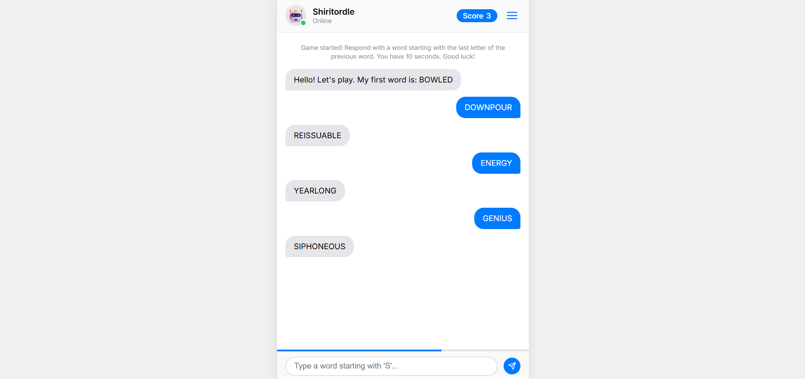

# Web app description:

Word-chain-dle? Uhh... A rapid-fire, single-player word game styled entirely like a modern mobile messaging app. The player duels against an omniscient, unbeatable AI bot. The bot throws a word, and the player has 10 seconds to respond with a valid English word starting with the last letter of the previous word.

# User interface:

# Running the project:

https://shiritordle.pages.dev/

Alternatively: Open index.html in your browser of choice.